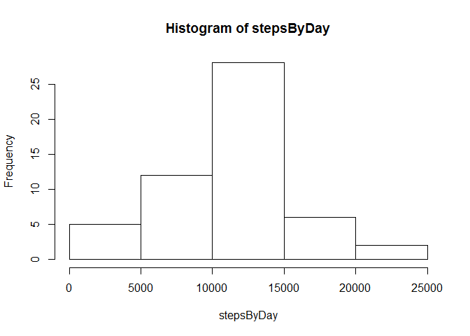
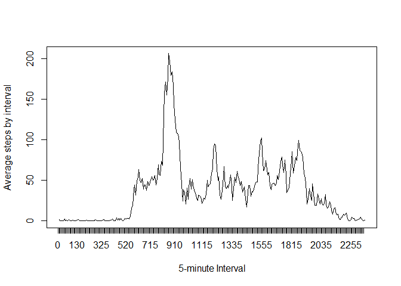
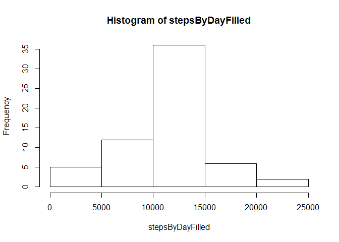
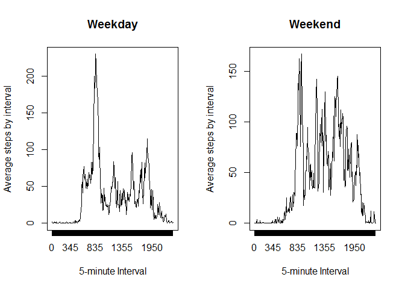

# Reproducible Research: Peer Assessment 1


## Loading and preprocessing the data

```r
activity <- read.csv("activity/activity.csv")
activity$date <- as.Date(as.character(activity$date))
```


## What is mean total number of steps taken per day?

```r
naFilter <- !is.na(activity$steps)
filtered <- activity[naFilter,]
stepsByDay <- by(filtered, filtered$date, function(x) sum(x$steps))
hist(stepsByDay)
```



```r
mean(stepsByDay)
```

```
## [1] 10766.19
```

```r
median(stepsByDay)
```

```
## 2012-11-12 
##      10765
```


## What is the average daily activity pattern?

```r
avgStepsByInterval <- by(filtered, filtered$interval, function(x) mean(x$steps))
plot(avgStepsByInterval, type="l", xaxt="n", xlab="5-minute Interval", ylab="Average steps by interval")
axis(1, at=seq(0,length(avgStepsByInterval)-1), labels=names(avgStepsByInterval))
```



```r
names(avgStepsByInterval)[which(avgStepsByInterval == max(avgStepsByInterval))]
```

```
## [1] "835"
```


## Imputing missing values

```r
sum(is.na(activity$steps))
```

```
## [1] 2304
```

```r
repAvg <- rep(avgStepsByInterval, length(activity$steps)/length(avgStepsByInterval))
naInd <- which(is.na(activity$steps))
filledActivity <- activity
filledActivity[naInd, "steps"] <- repAvg[naInd]

stepsByDayFilled <- by(filledActivity, filledActivity$date, function(x) sum(x$steps))
hist(stepsByDayFilled)
```



```r
mean(stepsByDayFilled)
```

```
## [1] 10766.19
```

```r
median(stepsByDayFilled)
```

```
## 2012-11-04 
##   10766.19
```
These values do not differ too much from the ones in the beginning of the report because the mean value for the interval was used to fill the NAs.  
On the estimates of the total daily number of steps it would make some difference, though, as the ignored values would have a value and would be counted this time.


## Are there differences in activity patterns between weekdays and weekends?

```r
Sys.setlocale("LC_TIME","English")
```

```
## [1] "English_United States.1252"
```

```r
wdays <- weekdays(filledActivity$date)
weekend <- wdays == "Saturday" | wdays == "Sunday"
wdays[weekend] <- "weekend"
wdays[!weekend] <- "weekday"
filledActivity <- cbind(filledActivity, wdays)

splitAct <- split(filledActivity, filledActivity$wdays)
wdaysAct <- splitAct[[1]]
wendAct <- splitAct[[2]]

avgStepsByIntervalWday <- by(wdaysAct, wdaysAct$interval, function(x) mean(x$steps))
avgStepsByIntervalWend <- by(wendAct, wendAct$interval, function(x) mean(x$steps))

par(mfrow=c(1,2))

plot(avgStepsByIntervalWday, type="l", xaxt="n", xlab="5-minute Interval", ylab="Average steps by interval", main = "Weekday")
axis(1, at=seq(0,length(avgStepsByIntervalWday)-1), labels=names(avgStepsByIntervalWday))

plot(avgStepsByIntervalWend, type="l", xaxt="n", xlab="5-minute Interval", ylab="Average steps by interval", main = "Weekend")
axis(1, at=seq(0,length(avgStepsByIntervalWend)-1), labels=names(avgStepsByIntervalWend))
```


    
There is indeed a noticeable difference between the Weekday and Weekend patterns. In weekends the steps doesn't peak at noon 
and they are higher during the afternoon.
